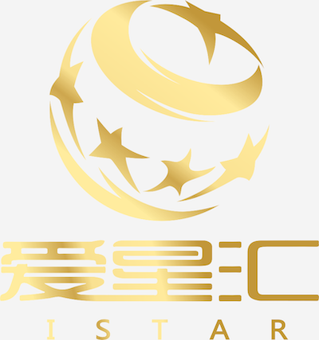

爱星汇（北京）文化传媒有限公司是一家 2016 年新成立的专业性、综合性的文化产业运营机构，公司将一直致力于综合类艺术教育（如音乐剧、乐团等教育培训、组织策划国际演出交流、影视音乐制作以及演艺经纪等开拓型项目，是集教育、演出、制作、经纪于一体的综合传媒公司，是文化娱乐产业中独树一帜的国际化公司。

爱星汇（iStar）整合了国际最顶尖的声乐、戏剧、舞蹈等众多教育优势资源，每年有 2-3 个国外夏令营输送优秀学生到迪士尼剧院、百老汇等地剧院学习演出，为专业与非专业的青少年和大学生提供国际化、高质量的音乐戏剧表演教育培训，目前有超过 1000 多位学生接受专业音乐剧训练和演出，学生来自上海五十多所国际、双语、公立、私立学校。

爱星汇（iStat）美国艺术教育协会的中国独家授权公司，曾作为美国但你将国际电子音乐比赛亚太区承办公司积极参与推进中美之间文化产业品牌项目，优势打造艺术教育的“教育+原创制作+演出经纪”三位一体的战略化平台，是在文化市场具有一定规模和良好品牌影响力的品牌文化企业。
