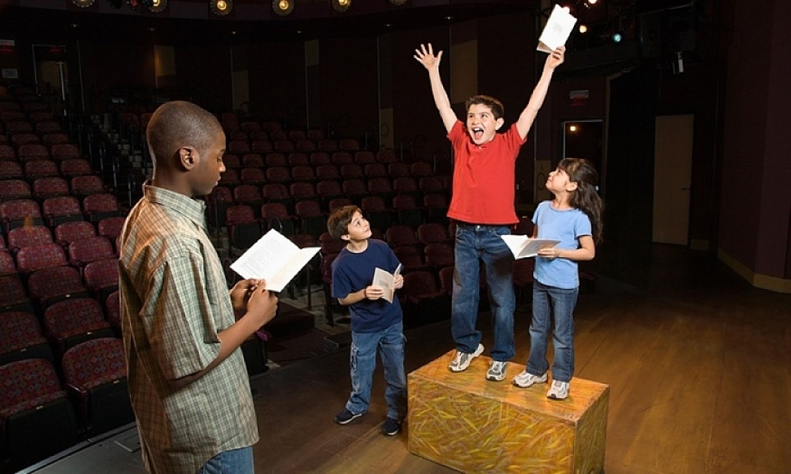

## 音乐剧介绍

音乐剧是综合艺术的代表。西方的儿童教育，音乐剧是教生活技能，生活态度，是培养、激发孩子们的生活热情和艺术潜能。音乐剧不同于单一的唱歌、跳舞、表演，它是综合的艺术体验，它是把经典的文学、历史、音乐、舞蹈、戏剧表演、美术、设计、工程、社会等各类知识结构融为一体的，以剧场舞台形式呈现。爱作剧与英国和美国多家儿童音乐剧机构合作，邀请儿童音乐剧教育专家亲自授课与培训老师，并参与剧目编排。运用西方的“音乐戏剧”多元教学法，把声乐、舞蹈、英文台词、自发性创造表演以及经典儿童音乐剧排演等多个学习内容融为一体，激发孩子们的音乐感知 musical sense、肢体协调 body balance、语言天赋 language gift、自我认知 self-awareness、人际交往 social communication 等多个方面的潜能，来提高他们的自信心、爱心、责任心、专注力、创造力、协作能力、自学能力和他们的综合艺术修养。真正的鼓励和激发孩子对学习和生活的热情。

音乐剧是一门相当综合类的戏剧艺术，它的普及是提高我们青少年综合素养的最好的方法之一，爱作剧更担当起社会的责任，通过与各学校合作，开设输出课程，让更多青少年可以接触到这门戏剧艺术；爱作剧更首创高品质音乐剧教育网络课程，以广播剧的形式让青少年在无法实地直接参与音乐剧学习和演出的状况下，通过听广播的方式学到经典的音乐剧片段，更通过每周一曲，学员可自学音乐剧曲目，陶冶性情！

## 教学理念

我们相信艺术是快乐的，而教育应该是严谨的。以专业的师资、科学的课程体系，为孩子提供地道的英式戏剧、音乐剧教育。不仅发掘孩子综合艺术潜能，更重要的是让他们勇敢自信、快乐社交。

## 机构介绍

爱星汇（北京）文化传媒有限公司是一家 2016 年新成立的专业性、综合性的文化产业运营机构，公司将一直致力于综合类艺术教育（如音乐剧、乐团等教育培训、组织策划国际演出交流、影视音乐制作以及演艺经纪等开拓型项目，是集教育、演出、制作、经纪于一体的综合传媒公司，是文化娱乐产业中独树一帜的国际化公司。

爱星汇是以音乐剧、戏剧为载体做为艺术教育最早的机构之一。爱星汇坚持关心和发掘每一个孩子的潜能，关注每个孩子的性格修养。音乐剧、戏剧艺术教育不仅仅是让他们获得声乐、表演、舞蹈上的技能，而是让他们成为人生中的独立个体，熟知对生活的态度，伴随他们一生。在舞台艺术中提炼自己的自律、专注、沟通和团队协作，同时增强自信、自尊和创造力。我们和孩子们是一个家庭式的团队，我们在一起探索创新，并享受过程的快乐！

爱星汇与加拿大、美国、英国等全球多所音乐剧专业的私立学校和大学建立长期的合作关系，每年都会组织学生进行游学等活动，并进行巡回演出，成为了音乐剧文化国际交流活动中的积极推动者。

爱星汇（iStar）整合了国际最顶尖的声乐、戏剧、舞蹈等众多教育优势资源，每年有 2-3 个国外夏令营输送优秀学生到迪士尼剧院、百老汇等地剧院学习演出，为专业与非专业的青少年和大学生提供国际化、高质量的音乐戏剧表演教育培训，目前有超过 1000 多位学生接受专业音乐剧训练和演出，学生来自上海五十多所国际、双语、公立、私立学校。

爱星汇（iStat）美国艺术教育协会的中国独家授权公司，曾作为美国但你将国际电子音乐比赛亚太区承办公司积极参与推进中美之间文化产业品牌项目，优势打造艺术教育的“教育+原创制作+演出经纪”三位一体的战略化平台，是在文化市场具有一定规模和良好品牌影响力的品牌文化企业。

## 师资力量

爱星汇有来自国内外阵容强大的专业师资团队，声台形表是音乐剧的四大基础。

声乐老师

舞蹈老师

表演老师

台词老师

## 课程设置

爱星汇根据学员年龄及音乐基础的不同，课程内容涵盖正统音乐剧唱腔介绍及演唱指导、即兴戏剧、剧场游戏及肢体能力训练、音乐剧舞台表演训练等，课程依据剧目的角色内容和难易程度共设立三个不同等级专业常规课，分别为启蒙班、初级班、中级班，还对有一定基础的学生开设了提升班，课程内容皆有前后关联性，学员必须依顺序报名学习。

### （一）常规班

#### 启蒙班

启蒙班以寓教于乐为主旨，以启迪学龄前儿童戏剧音乐萌芽，开发这个年龄层孩子在视听练耳的潜能、肢体协调律动的记忆、挖掘想象力和自然纯真的表现力；强化个性，训练孩子的专注力、观察力、模仿力、协作能力等，提高自信与勇敢，为音乐剧启蒙做好兴趣铺垫。

- 年龄：3-6 岁
- 培训内容：艺术启蒙、声乐演唱、角色带入、游戏互动
- 培训时间：45 分钟/课时
- 培训费：元/人
- 招收名额：每班 10-20 名（额满即止）

#### 初级班

初级班为零基础音乐剧基础或非系统性学习的有单项基础的学员而设，给予学员系统的音乐剧技能培养，包括声乐基础、肢体和舞蹈训练、戏剧表演基础、台词朗读、角色演绎等；课程以原版英文 JR 剧目为基础，同步打基础和学剧目，让学员身临其境理解音乐剧以音乐讲故事的戏剧形态；年度的学习成就将以年中的小型汇报和年度的原版音乐剧专业舞台演出来体现，为音乐剧打好坚实地基础。

- 年龄：6-9 岁
- 培训内容：声乐演唱、台词表演、舞蹈基础
- 培训时间：60 分钟/课时
- 培训费：元/人
- 招收名额：每班 10 - 20 名（额满即止）

#### 中级班

中级班课程在初级班基础上，对学员各种技能上更严格的要求和训练，对视唱练耳、和声、轮唱重唱、个人和集体角色演绎、编舞等都加大难度；同时增加学员对剧目理解、舞台上整体把控、一人分饰几角的要求。

课程以原版英文剧目 JR 或 Amateur 版本为学习内容，同步更扎实基础训练和学习剧目；增加剧目解析和 Competition 课，力求学员自我挖掘剧目内涵，了解剧目戏剧冲突，自发组合或个人演绎的良性比赛，让学员互相探讨互相学习，更积极成为课堂的主导者。

- 年龄：9-12 岁
- 培训内容：声乐演唱、台词表演、舞蹈基础、戏剧表演
- 培训时间：90 分钟/课时
- 培训费：元/人
- 招收名额：每班 10-20 名（额满即止）

### （二）提升班

提升班设置专为已在爱作剧中级班就读二年以上并以取得专业评估和证书的学员而设，旨在以等同于专业音乐剧标准课程设置，培养学员成为专业青少年音乐剧演员，提供国内外演出机会、游学机会、迪斯尼专业学习机会等其他专业训练，同时每个学员需选修音乐剧领域除表演类外的门课，如编剧、编舞、作曲、舞美设计、戏服设计等；学员需具有良好的接近半专业能力的音乐剧技能，包括扎实的乐理知识、良好的声乐表演舞蹈能力；完全自学能力包括原版英文剧本阅读和理解、自学识谱演唱，角色理解演绎，音乐剧演出技术合成的综合知识等。

- 年龄：16-22 岁
- 培训内容：声乐演唱、台词表演、舞蹈基础、戏剧文学
- 培训时间：120 分钟/课时
- 培训费：元/人
- 招收名额：每班 10-20 名（额满即止）

### 音乐活动

#### 音乐剧大师课

爱星汇定期邀请国内外的音乐剧各专业类教授，为爱星汇的学生开设大师班，力求让学生从广度和深度了解音乐剧的庞大工程，更让学生体会到术有专攻，细分到的每一个音乐剧板块都是专业的积累，不仅仅舞台上演员的光彩，背后的付出更是巨大的和成就的。

#### 音乐剧参观课

爱星汇与各大剧院紧密合作，为普及艺术教育作出微薄贡献，爱星汇定期会带领学生及家长参观剧场、音乐厅等演出地，让学生能够深入探索剧场的运作，了解台前幕后的秘密，例如：声音技术和灯光技术、舞台的变换、演员的后台准备，乐池与舞台的关系等等，让学生明白音乐剧是需要各个部门配合协作完成的。

#### 音乐剧欣赏课

爱星汇定期会组织学生和家长到剧场欣赏一些国内外经典的音乐剧目演出，近距离地接触艺术家，致敬大师，在欣赏经典的同时感受音乐剧的魅力，开阔视野。

#### 演出以及夏令营游学

爱星汇组织学生进行学期汇报演出、寒暑假进行国内巡回演出以及国外夏令营游学活动，例如：迪斯尼等，为学生提供展示自己的平台，锻炼团队的合作能力，积累演出经验。

## 资格认证

爱星汇授权于美国 AAEA 协会，我们将对每年通过培训并参加比赛、演出和游学等活动的学生颁发具有权威性国际认证的证书。

### 课程教材:

1. 《音乐剧演唱法》
2. 《音乐剧舞蹈基础教学》（踢他舞、爵士舞、芭蕾舞）
3. 《戏剧表演课》
4. 《戏剧文学》（台词、剧本赏析）
5. 《创意游戏课》或《戏剧角色体验课》

### 排演剧目

美国 iStar 音乐戏剧联盟，拥有旗下众多百老汇音乐剧资源：《狮子王》、《小美人鱼》、《小飞侠》、《雾都孤儿》、《悲惨世界》、《歌剧魅影》、《猫》、《巴黎圣母院/钟楼怪人》、《蜘蛛侠》、《丑小鸭》、《怪物史瑞克》、《少儿班妈妈咪呀》、《孩子与魔法》、《小王子》、《三只小猪》、《战马》、《绿野仙踪》、《出租屋》、《16 街》、《歌舞青春》等。

## 报名通道

常年招生，可免费体验半小时课程。

- 联系人：庄老师
- 联系电话：
- 报名方式：
- 报名日期：
- 上课地点：
